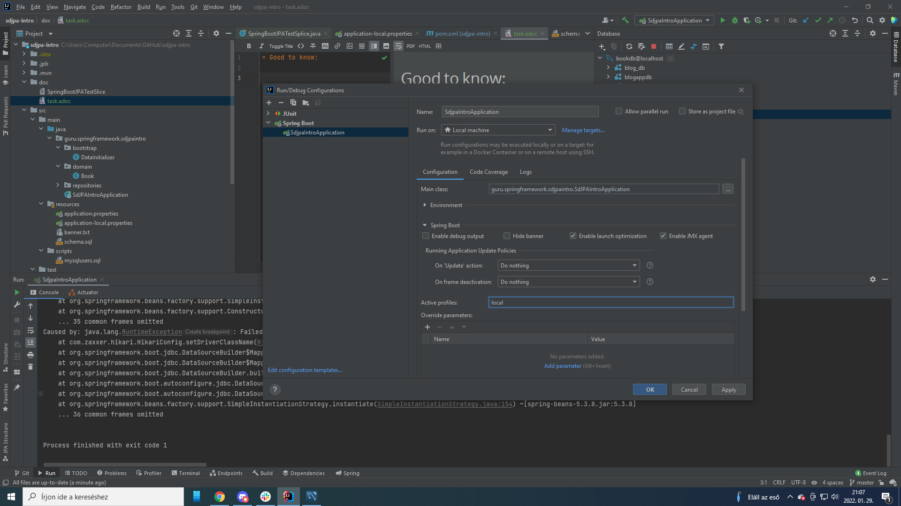
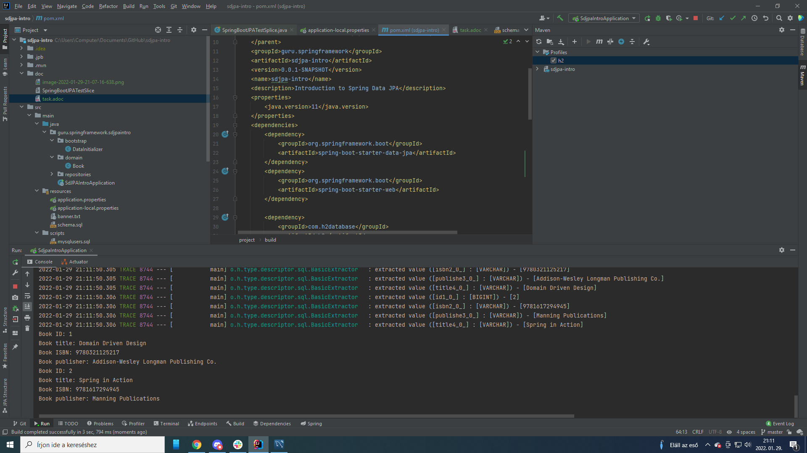

= Good to know:

after removing local from here:

we have to make setup in pom.xml & enable in profile (h2 and ossrh if it exists there!):

after enable do not forget to refresh the maven dependency!

From liquibase you need the most recent version!

https://mvnrepository.com/artifact/org.liquibase/liquibase-maven-plugin
